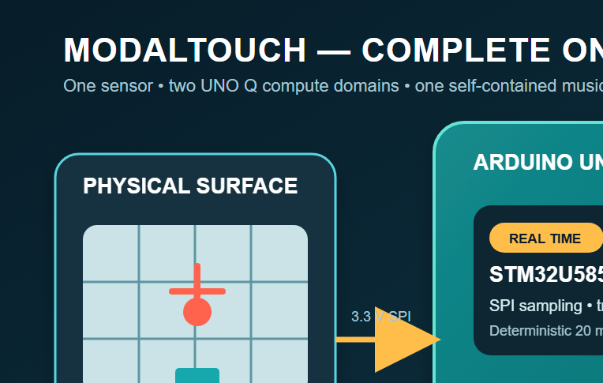
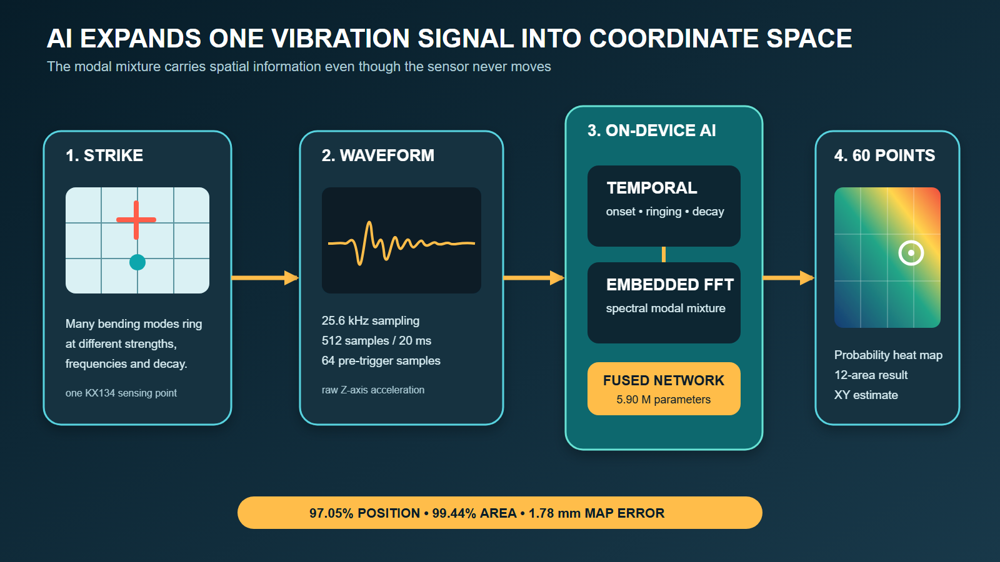

# ModalTouch — AI Acrylic Instrument on Arduino UNO Q



ModalTouch turns a **400 × 300 × 5 mm acrylic sheet** into a low-latency musical instrument and tangible controller. One KX134-1211 accelerometer captures the vibration from each strike. An embedded-FFT neural network running on Arduino UNO Q expands that single waveform into a probability field over 60 physical positions, an XY estimate, and one of 12 playable areas.

The complete application runs on UNO Q: 25.6 kHz acquisition, impact detection, TensorFlow Lite inference, UVC camera streaming, perspective-mapped heat-map rendering, FluidSynth audio generation, training-data collection, and the Wi-Fi web server. No cloud inference is required.

> 日本語で全体を確認する場合は、[Hackster Story日本語版](docs/hackster-story-ja.html)を開いてください。

## Highlights

- One fixed accelerometer senses the whole acrylic surface.
- STM32U585 captures the Z axis at **25.6 kHz**, ±32 g, without five-sample averaging.
- Each event contains **512 samples / 20 ms**, including 64 pre-trigger samples.
- QRB2210 runs a **5.90 M-parameter embedded-FFT model** using LiteRT/TFLite.
- The held-out evaluation covers **all 60 positions** with complete-session separation.
- The camera overlay, winning panel, 12-area bars, and XY result share the same probability distribution.
- FluidSynth renders and caches 44.1 kHz instrument notes on UNO Q.
- The acquisition, inference, camera, audio, and web services start automatically after boot.

## Independent-session AI results

The 7,132 measured strikes are split by complete recording session, not by randomly mixing similar events. Training, validation, and held-out test each contain all 60 positions, including the 12 area centers.

| Split | Sessions | Strikes | Position coverage |
|---|---:|---:|---:|
| Training | 7 | 3,545 | 60 / 60 |
| Validation | 2 | 1,080 | 60 / 60 |
| Held-out test | 2 | 2,507 | 60 / 60 |

Selected model: `uno_q_fft_candidates/acrylic_pan_fft_hybrid_large_fp16.tflite`

| Metric | Held-out result |
|---|---:|
| 60-position top-1 accuracy | **97.05%** |
| 12-area accuracy | **99.44%** |
| MAP coordinate mean error | **1.78 mm** |
| Probability-weighted XY mean error | **1.76 mm** |
| Model size | 11.82 MB FP16 |

See [embedded-FFT model evaluation](docs/uno-q-fft-hybrid-evaluation-20260911.md) for the split contract, baseline comparison, and model details.



## Hardware architecture

```text
KX134-1211 accelerometer
    │ 3.3 V SPI, ±32 g, 25.6 kHz
    ▼
STM32U585 real-time MCU
    │ trigger + 64 pre-trigger + 512-sample capture
    │ eight packed Arduino Bridge chunks
    ▼
QRB2210 Linux MPU
    ├─ embedded-FFT TFLite inference
    ├─ UVC camera stream
    ├─ FluidSynth audio cache
    ├─ append-only labelled data collection
    └─ port 8765 web application
```

The KX134 uses 3.3 V only. Do not connect it to 5 V. The confirmed SPI signals are:

| KX134-1211 EVK | Arduino UNO Q |
|---|---|
| VDD, IO_VDD | 3.3 V |
| GND | GND |
| nCS | D10 / SS |
| SDI / SDA | D11 / COPI |
| SDO / ADDR | D12 / CIPO |
| SCLK / SCL | D13 / SCK |
| INT1 / DRDY | D2, diagnostic |
| INT2 | D3, optional diagnostic |

Use the [complete wiring guide](docs/uno-q-sensor-wiring.md) and [BOM](docs/uno-q-bom.md) before powering the board.

## Web application

UNO Q serves the application on port 8765:

| Page | URL | Purpose |
|---|---|---|
| Home / health | `http://<UNO-Q-IP>:8765/` | Sensor and application status |
| Collector | `/collector.html` | Labelled KX134 capture and waveform review |
| Position | `/position.html` | 60-point heat map and XY inference |
| Instrument | `/instrument.html` | 12-area performance mode |
| Probability instrument | `/instrument-probability.html` | Camera overlay, full probability and audio |
| Camera test | `/camera-test.html` | UNO Q UVC stream verification |

The browser requires one click on **Start performance / 演奏開始** to unlock Web Audio. After that, strikes are detected, localized, visualized, and sounded without manually starting services.

## Deploy to UNO Q

Prerequisites:

- Arduino UNO Q with App Lab support
- KX134-1211 evaluation board and verified 3.3 V SPI adapter
- externally powered USB-C hub and UVC camera
- stable 5 V / 3 A supply
- Windows OpenSSH client for Wi-Fi deployment

From PowerShell in the repository root:

```powershell
.\scripts\deploy-uno-q-wifi.ps1 -Target arduino@<UNO-Q-IP>
```

The deployment preserves the remote `data` directory, provisions the audio runtime, enables UVC camera auto-selection, and sets the application containers to restart after a power cycle. Detailed operational notes are in [`uno_q_app/README.md`](uno_q_app/README.md).

## Collect training data

Open `http://<UNO-Q-IP>:8765/collector.html`, select the labelled position, and start the session manually. Captures are append-only and can be reviewed or deleted individually from the collector page.

The repository does not expose an automatic training pipeline in the UI. Preserve and copy the JSONL data to a development PC before retraining. The default on-board path is:

```text
/home/arduino/ArduinoApps/acrylic-pan-dummy/data/training/kx134_events.jsonl
```

## Reproduce model training

Training dependencies:

```powershell
python -m venv .venv
.\.venv\Scripts\python -m pip install -r requirements-model-training.txt
```

The raw measured sessions are intentionally excluded from Git because of their size. Supply a directory containing the recorded `acrylic-pan-session-v1` sessions:

```powershell
.\.venv\Scripts\python scripts\train_uno_q_fft_hybrid_models.py `
  --sessions <path-to-raw-sessions> `
  --output uno_q_fft_candidates `
  --epochs 120 `
  --seed 20260912
```

The script validates the exact session split and refuses to continue unless training, validation, and test each cover all 60 positions.

## Test

Run the UNO Q application and model-contract tests:

```powershell
.\.venv\Scripts\python -m unittest discover -s tests -p "test_uno_q*.py"
```

The current suite verifies the TFLite artifact hashes, embedded `RFFT2D` operators, full-grid split coverage, model accuracy contracts, UI model selection, collector behavior, and audio service contract.

## Repository map

| Path | Contents |
|---|---|
| `uno_q_app/` | App Lab application: STM32 sketch, Python service, camera/audio/web UI |
| `uno_q_fft_candidates/` | Selected and comparison embedded-FFT TFLite artifacts and evaluation report |
| `uno_q_model_candidates/` | CPU MLP and temporal CNN comparison artifacts |
| `scripts/` | Deployment, training, conversion, and benchmarking tools |
| `tests/` | Application, data, and model-contract tests |
| `docs/` | Current wiring, BOM, evaluation, camera, and build documentation |
| `docs/assets/hackster/` | Contest-ready diagrams, animation, and figures |
| `web/assets/simulation/` | Thin-plate, 3D solid, and CalculiX simulation results |
| `data/position_model_400x300/` | Earlier portable 400 × 300 position-model reference |
| `pc/`, `firmware/`, `sim/`, `calculix/`, `doc/` | Supporting experiments, analysis tools, and archived reference material |

Use the [documentation index](docs/README.md) to find the shortest path to each subject.

## Contest material

- [Japanese Story preview](docs/hackster-story-ja.html)
- [Story image placement plan](docs/hackster-story-media-plan.md)
- [Contest submission checklist](CONTEST_SUBMISSION.md)
- [Hackster-ready figures](docs/assets/hackster/)

## Credits and licensing

- GeneralUser GS by S. Christian Collins is rendered on UNO Q with FluidSynth. Its full notice is stored at [`uno_q_app/python/soundfonts/LICENSE.GeneralUser-GS.txt`](uno_q_app/python/soundfonts/LICENSE.GeneralUser-GS.txt).
- TensorFlow Lite/LiteRT, FluidSynth, Arduino App Lab, and the remaining dependencies retain their respective upstream licenses.
- See [third-party notices](THIRD_PARTY_NOTICES.md) for source links and bundled-asset notes.

The repository currently has no top-level project license declaration. Add one before inviting reuse or accepting outside contributions.
