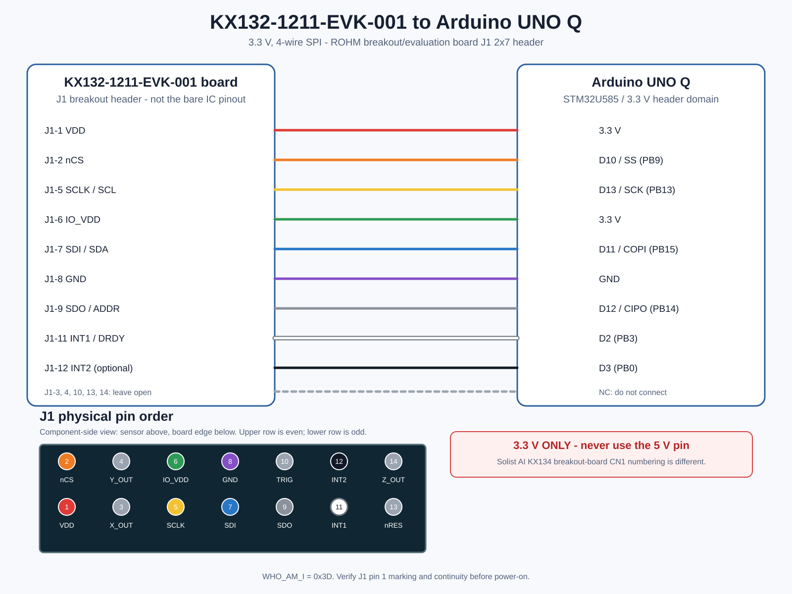

# KX132-1211-EVK-001 - Arduino UNO Q 配線

## 結論

KX132-1211-EVK-001は、KX132-1211センサーICを搭載したROHMのブレークアウト／評価基板である。この資料のピン番号は、12ピンLGAのセンサーIC本体ではなく、評価基板上のJ1（2列7ピン、2.54 mmピッチ）を示す。J1からUNO Qの3.3 V系SPIへ接続する。
Solist AI用KX134ブレークアウトボードのCN1とはピン番号が異なるため、旧ケーブル用の変換配線をそのまま流用しない。



## J1からUNO Qへの対応

> **対象の確認:** 下表は`KX132-1211-EVK-001`基板のJ1ピン配置であり、KX132-1211 IC本体の端子表ではない。

| KX132 EVK J1 | 信号 | UNO Q | 用途 |
| ---: | --- | --- | --- |
| 1 | VDD | 3.3 V | センサー電源 |
| 2 | nCS | D10 / SS / PB9 | SPIチップセレクト |
| 3 | X_OUT | NC | このデジタルセンサー基板では未使用 |
| 4 | Y_OUT | NC | このデジタルセンサー基板では未使用 |
| 5 | SCLK / SCL | D13 / SCK / PB13 | SPIクロック |
| 6 | IO_VDD | 3.3 V | デジタルI/O電源 |
| 7 | SDI / SDA | D11 / COPI / PB15 | UNO QからKX132へのデータ |
| 8 | GND | GND | 共通GND |
| 9 | SDO / ADDR | D12 / CIPO / PB14 | KX132からUNO Qへのデータ |
| 10 | SYNC / TRIG | NC | 初期実装では未使用 |
| 11 | INT1 | D2 / PB3 | データ準備割り込み |
| 12 | INT2 | D3 / PB0 | 予備割り込み（任意） |
| 13 | nRES | NC | KX132-1211-EVK-001では未使用 |
| 14 | Z_OUT | NC | このデジタルセンサー基板では未使用 |

## コネクタの向き

基板の部品面を上から見て、センサーを上、J1を下に置く。センサーに近い列が奇数、基板端側が偶数で、左端が1/2、右端が13/14になる。

```text
                 KX132-1211
                     ^
                     |
        J1（部品面を上から見た配置）
         1   3   5   7   9  11  13
         2   4   6   8  10  12  14
```

リボンケーブルを使う場合、相手側コネクタを嵌合面から見ると左右が反転する。番号や赤線だけに頼らず、J1-1から変換基板1番ピンまでの導通を確認する。

## 設計上の判断

- VDDとIO_VDDはどちらもUNO Qの3.3 Vへ接続する。KX132-1211の許容電源範囲は1.7～3.6 Vで、5 Vは禁止。
- 最高25.6 kHzのODRを扱えるよう、I2Cではなく4線SPIを採用する。
- SPIはUNO Qの標準D10～D13を使い、INT1をD2へ割り当てる。INT2は必要な機能を追加するときだけD3へ接続する。
- 初回通信では`WHO_AM_I = 0x3D`を確認する。
- KX132-1211は最大±16 gである。旧KX134-1211の最大±64 gとは測定レンジが異なるため、衝撃波形の飽和を実機で確認する。

## 電源投入前チェック

1. UNO QのUSBを外した状態で配線する。
2. J1-1とJ1-6が3.3 V、J1-8がGNDへ接続されていることを導通確認する。
3. J1-2/5/7/9がD10/D13/D11/D12へ接続されていることを確認する。
4. J1-3/4/10/13/14が開放されていることを確認する。
5. VDD-GND間の短絡がないことを確認してからUSBを接続する。

## 参照資料

- [ROHM KX132-1211-EVK-001 使い方資料](https://www.rohm.com/support/accelerometer-evk-support) - No. 64UG018J Rev.001。基板名、J1、電源範囲、通信方式、基板写真
- [ROHM EVK HW User's Guide](https://fscdn.rohm.com/jp/products/databook/applinote/ic/sensor/rohm-evk-hw_ug-j.pdf) - No. 64UG115J Rev.003。Table 5のJ5信号マッピングとFigure 15のJ1/J5回路
- [ROHM / Kionix KX132-1211 Specifications](https://fscdn.rohm.com/kionix/en/datasheet/kx132-1211-e.pdf) - Rev.4.0。12ピンLGA ICの電気仕様、SPI、`WHO_AM_I`
- [Arduino UNO Q Full Pinout](https://docs.arduino.cc/resources/pinouts/ABX00162-full-pinout.pdf) - UNO QのD2/D3、D10-D13、3.3 V端子
